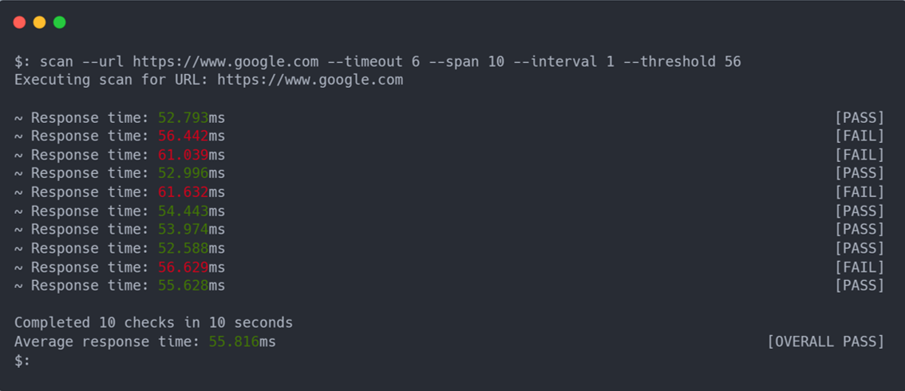

 

  

  <h3 align="center">Receptors</h3>

  

    A command line URL checker utilising Requests and Argparse, aiming to deliver a user friendly approach to a somewhat otherwise tedious task.
     
     
  

## Table Of Contents

* [About the Project](#about-the-project)
* [Built With](#built-with)
* [Getting Started](#getting-started)
* [Contributing](#contributing)
* [License](#license)
* [Authors](#authors)

## About The Project

<!--  -->

Receptors is a command line program for making the process of checking the status, response time and other various info about a URL, easier.

Here's why:

* Your time should be valued, and checking URL's manually is not something that will benefit you. 
* Receptors aims to correct this by providing a simple and easy to use command line program which will do it for you, requiring little to no input and writing results to a file!

## Built With

* Requests
* Argparse

## Getting Started

## Contributing

Contributions are what make the open source community such an amazing place to be learn, inspire, and create. Any contributions you make are **greatly appreciated**.
* If you have suggestions for adding or removing projects, feel free to [open an issue](https://github.com/lunAr-creator/URL-Checker/issues/new) to discuss it, or directly create a pull request after you edit the *README.md* file with necessary changes.
* Please make sure you check your spelling and grammar.
* Create individual PR for each suggestion.
* Please also read through the [Code Of Conduct](https://github.com/lunAr-creator/URL-Checker/blob/main/CODE_OF_CONDUCT.md) before posting your first idea as well.

### Creating A Pull Request

1. Fork the Project
2. Create your Feature Branch (`git checkout -b feature/AmazingFeature`)
3. Commit your Changes (`git commit -m 'Add some AmazingFeature'`)
4. Push to the Branch (`git push origin feature/AmazingFeature`)
5. Open a Pull Request

## License

Distributed under the MIT License. See [LICENSE](https://github.com/lunAr-creator/URL-Checker/blob/main/LICENSE) for more information.

## Authors

* [lunAr-creator](https://github.com/lunAr-creator/) 
